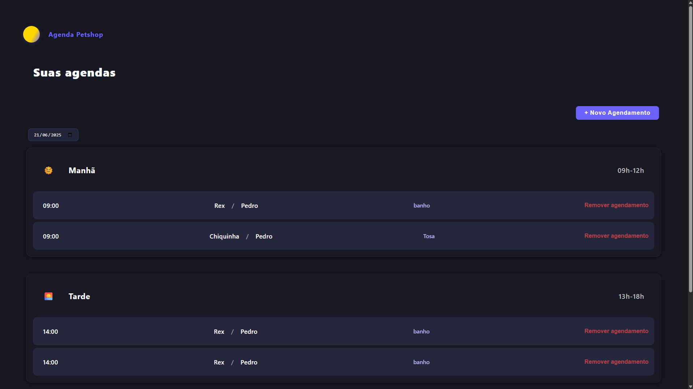

# 🐾 Petshop Frontend

💻 A modern and intuitive React application for scheduling pet appointments and managing petshop services.

## 📋 Table of Contents
- [✨ Features](#features)
- [🛠️ Technologies Used](#technologies-used)
- [🏗️ Project Structure](#project-structure)
- [🚀 Getting Started](#getting-started)
- [🖼️ Screenshots](#screenshots)
- [🤝 Contributing](#contributing)

## ✨ Features
- 📅 Schedule pet appointments easily
- 👩‍⚕️ Manage clients and services
- 📆 Date filtering for appointments
- 🌙 Modern, responsive UI
- 🔗 Connects to backend API for real data

## 🛠️ Technologies Used
- 
- 
- 
- 

## 🏗️ Project Structure
```
frontend-petshop/
├── public/                # Static assets
├── src/
│   ├── components/        # UI Components
│   │   ├── AgendaList.js  # List of appointments
│   │   ├── AgendamentoForm.js # Appointment form
│   │   ├── DateFilter.js  # Date filter control
│   │   └── ...
│   ├── api.js             # API integration
│   ├── App.js             # Main app component
│   └── ...
├── package.json           # Project metadata and dependencies
└── ...
```

## 🚀 Getting Started
1. **Clone the repository**
   ```bash
   git clone https://github.com/your-username/api-petshop.git
   cd api-petshop/frontend-petshop
   ```
2. **Install dependencies**
   ```bash
   npm install
   ```
3. **Run the development server**
   ```bash
   npm start
   ```
4. **Open in your browser**
   ```
   http://localhost:3000
   ```

## 🖼️ Screenshots


## 🤝 Contributing
Pull requests are welcome! For major changes, please open an issue first to discuss what you would like to change.

---

Made with ❤️ by Pedro